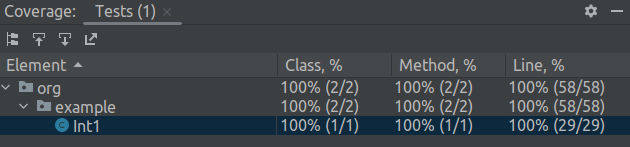

# Testing. Java.

### Task:
Test the prebuilt Integer.decode(String nm) method from the Java Standard Library.

Examine the documentation for the method and code method.

All possible branches in the code appear and what arguments lead to entering these branches.

Write tests (at least 8) so that they cover all method code definitions. That is, to perform the tests, each series of 
mechanisms was executed 1 time.*
###### *_translate from RU_

### Result:
100% coverage, yay!

